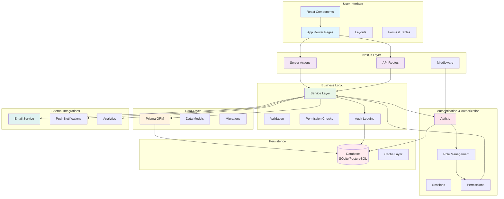

# ITSM Application Architecture Diagram

## Component Descriptions

### User Interface
- **React Components**: Reusable UI components (buttons, modals, tables)
- **App Router Pages**: Next.js 14+ pages using React Server Components
- **Layouts**: Shared layouts for consistent UI structure
- **Forms & Tables**: Form handling and data display components

### Next.js Layer
- **Server Actions**: Direct server functions called from client components
- **API Routes**: RESTful endpoints for external integrations
- **Middleware**: Request interception for auth, logging, etc.

### Business Logic
- **Service Layer**: Core business logic and use cases
- **Validation**: Input validation and sanitization
- **Permission Checks**: Fine-grained access control
- **Audit Logging**: Tracking system activities

### Data Layer
- **Prisma ORM**: Database abstraction and query building
- **Data Models**: TypeScript definitions for database entities
- **Migrations**: Schema version control

### Authentication & Authorization
- **Auth.js**: NextAuth.js implementation for authentication
- **Sessions**: User session management
- **Role Management**: Role-based access control
- **Permissions**: Fine-grained permission system

### Persistence
- **Database**: SQLite (development) / PostgreSQL (production)
- **Cache Layer**: Potential caching layer for performance

### External Integrations
- **Email Service**: Transactional email delivery
- **Push Notifications**: Real-time user notifications
- **Analytics**: Usage tracking and reporting

## Data Flow
1. User interacts with UI components
2. Actions trigger Server Actions or API calls
3. Requests pass through middleware for authentication
4. Business logic services process requests
5. Services interact with data layer via Prisma
6. Data persisted to database
7. Results returned to UI
8. External services notified as needed