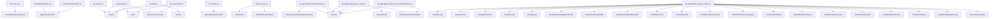

# Dependencies Diagram

```mermaid
graph TD
  next-env_d_ts --> next_dev_types_routes_d_ts["./.next/dev/types/routes.d.ts"]
  test-pdf-generation_ts --> app_reports_actions["./app/reports/actions"]
  test-report-generation_ts --> app_reports_actions["./app/reports/actions"]
  lib_access_ts --> prisma["./prisma"]
  lib_api-auth_ts --> auth["./auth"]
  lib_api-auth_ts --> prisma["./prisma"]
  lib_api-auth_ts --> permission-shortcuts["./permission-shortcuts"]
  lib_auth_ts --> prisma["./prisma"]
  lib_auth_ts --> access["./access"]
  lib_prisma_ts --> generated_prisma_client["./generated/prisma/client"]
  lib_server-auth_ts --> auth["./auth"]
  lib_server-auth_ts --> prisma["./prisma"]
  lib_server-auth_ts --> permission-shortcuts["./permission-shortcuts"]
  prisma_seed_ts --> lib_prisma["../lib/prisma"]
  prisma_seed_ts --> lib_default-permissions["../lib/default-permissions"]
  lib_generated_prisma_browser_ts --> internal_prismaNamespaceBrowser["./internal/prismaNamespaceBrowser"]
  lib_generated_prisma_browser_ts --> enums["./enums"]
  lib_generated_prisma_browser_ts --> enums["./enums"]
  lib_generated_prisma_client_ts --> enums["./enums"]
  lib_generated_prisma_client_ts --> internal_class["./internal/class"]
  lib_generated_prisma_client_ts --> internal_prismaNamespace["./internal/prismaNamespace"]
  lib_generated_prisma_client_ts --> enums["./enums"]
  lib_generated_prisma_client_ts --> enums["./enums"]
  lib_generated_prisma_commonInputTypes_ts --> enums["./enums"]
  lib_generated_prisma_commonInputTypes_ts --> internal_prismaNamespace["./internal/prismaNamespace"]
  lib_generated_prisma_models_ts --> models_User["./models/User"]
  lib_generated_prisma_models_ts --> models_Ticket["./models/Ticket"]
  lib_generated_prisma_models_ts --> models_Comment["./models/Comment"]
  lib_generated_prisma_models_ts --> models_Asset["./models/Asset"]
  lib_generated_prisma_models_ts --> models_SLA["./models/SLA"]
  lib_generated_prisma_models_ts --> models_KnowledgeBaseArticle["./models/KnowledgeBaseArticle"]
  lib_generated_prisma_models_ts --> models_AutomationRule["./models/AutomationRule"]
  lib_generated_prisma_models_ts --> models_AutomationExecution["./models/AutomationExecution"]
  lib_generated_prisma_models_ts --> models_Account["./models/Account"]
  lib_generated_prisma_models_ts --> models_Session["./models/Session"]
  lib_generated_prisma_models_ts --> models_VerificationToken["./models/VerificationToken"]
  lib_generated_prisma_models_ts --> models_PermissionCategory["./models/PermissionCategory"]
  lib_generated_prisma_models_ts --> models_Permission["./models/Permission"]
  lib_generated_prisma_models_ts --> models_RolePermission["./models/RolePermission"]
  lib_generated_prisma_models_ts --> models_UserPermission["./models/UserPermission"]
  lib_generated_prisma_models_ts --> models_CustomRole["./models/CustomRole"]
  lib_generated_prisma_models_ts --> models_RoleHierarchy["./models/RoleHierarchy"]
  lib_generated_prisma_models_ts --> models_AuditLog["./models/AuditLog"]
  lib_generated_prisma_models_ts --> models_IntegrationConfig["./models/IntegrationConfig"]
  lib_generated_prisma_models_ts --> commonInputTypes["./commonInputTypes"]
```